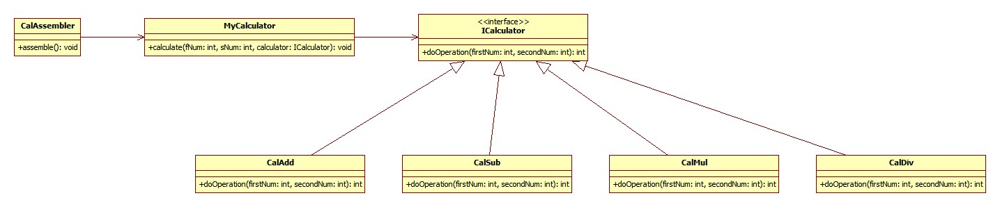

# 계산기 실습
## 1. 다형성: ICalculator --> CalAdd(), CalSub(), CalMul(), CalDiv()
## 2. DI(Dependency Injection,의존성 주입) --> CalAssembler
## 3. IoC(Inversion of Control, 제어의 역전) --> CalAssembler --> 객체 생성 + 조립

